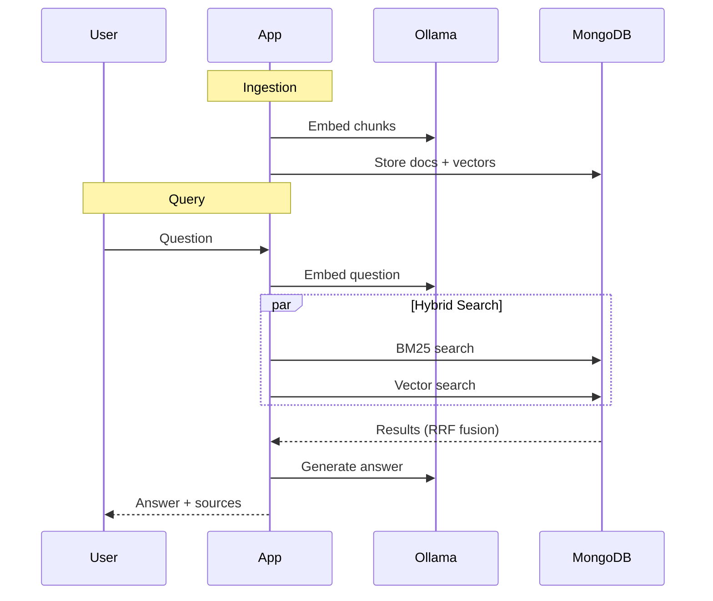

# RAG Assignment - Hybrid Search

A fully local retrieval-augmented generation (RAG) system using hybrid search.

## Architecture

The architecture of this project is driven by the requirement to run it all locally and not use cloud services.



- **Vector Database**: MongoDB Atlas (Docker)
- **Embeddings**: Ollama with nomic-embed-text
- **LLM**: Ollama with llama3.2
- **Tracing**: LangFuse v3
- **Application**: Python

## Setup

### 1. Install and Start Ollama

```bash
# Install Ollama
brew install ollama

# Start the server (not needed if ollama is configured to run in the background)
ollama serve
```

In a new terminal, pull the required models:

```bash
# Embedding model (768 dimensions)
ollama pull nomic-embed-text

# LLM for generation and evaluation
ollama pull llama3.2
```

### 2. Start Docker Services

Start MongoDB and LangFuse:

```bash
docker compose up -d
```

Verify services are running:

```bash
docker compose ps
```

You should see `rag-mongo`, `rag-langfuse`, and `rag-langfuse-db` running.

### 3. Configure LangFuse (Tracing)

1. Open http://localhost:3000
2. Create an account (local only, use any email/password)
3. Create a new project
4. Go to **Settings → API Keys → Create new API keys**
5. Copy `.env.example` to `.env` and add your keys:

```bash
cp .env.example .env
```

Then edit `.env` with your keys:

```
LANGFUSE_SECRET_KEY=sk-lf-xxxxx
LANGFUSE_PUBLIC_KEY=pk-lf-xxxxx
```

### 4. Build the App Container

```bash
docker compose build app
```

### 5. Ingest Documents

```bash
docker compose run --rm app python hybrid-search/ingestion.py
```

### 6. Create MongoDB Vector Search Index

After ingestion, create the vector search index:

```bash
docker compose exec mongo mongosh --eval '
db = db.getSiblingDB("product_docs_rag");
db.hybrid_search.createSearchIndex({
  name: "vector_index",
  type: "vectorSearch",
  definition: {
    fields: [{
      type: "vector",
      path: "embedding",
      numDimensions: 768,
      similarity: "cosine"
    }]
  }
});
'
```

Verify the index is ready:

```bash
docker compose exec mongo mongosh --eval '
db = db.getSiblingDB("product_docs_rag");
db.hybrid_search.getSearchIndexes();
'
```

Wait until `status: "READY"` appears.

### 7. Test Retrieval

```bash
docker compose run --rm app python hybrid-search/retrieval.py
```

### 8. Run Interactive Q&A

```bash
docker compose run --rm app python hybrid-search/generation.py
```

The application will prompt for a question.

## Services

| Service  | URL                   | Purpose                   |
| -------- | --------------------- | ------------------------- |
| MongoDB  | localhost:27017       | Vector database           |
| Ollama   | localhost:11434       | Embeddings & LLM (native) |
| LangFuse | http://localhost:3000 | Tracing & observability   |

## Design Decisions

### RAG Pattern: Hybrid Search

**Choice:** Hybrid search combining BM25 (keyword) and vector search (semantic) with Reciprocal Rank Fusion (RRF).

**Rationale:** Product documentation contains both:

- Exact identifiers that benefit from keyword matching (API routes like `GET /developer/events`, feature names, role names)
- Conceptual questions that benefit from semantic search ("how do I configure webhooks", "user can't export data")

Pure vector search can miss exact terminology. Pure keyword matching may miss semantic similarity. Hybrid search captures both.

### Chunking Strategy

**Choice:** Documents larger than 2000 characters are split into overlapping chunks,

**Rationale:** The local embedding model (`nomic-embed-text`) has context limits. While most product documentation pages are small (~300-500 tokens), some larger documents exceed the model's context window.

- **Chunk size**: 2000 characters
- **Overlap**: 200 characters (preserves context at boundaries)
- **Only chunks when needed**: Small documents remain whole

This approach balances retrieval precision (keeping related content together) with model constraints.

### Reciprocal Rank Fusion Parameters

**RRF Constant (k=60):** Standard default from the original RRF paper. Higher values reduce the influence of rank position, giving more equal weight to all retrieved documents.

**Weights (0.5 BM25 / 0.5 Vector):** Equal weighting as a balanced starting point. The retrieval module exposes these as parameters for tuning based on query patterns.

**Candidate multiplier (3x):** Retrieve 3x the final `k` documents from each method before fusion, ensuring sufficient candidates for RRF to rerank effectively.

### Evaluation: Precision with LLM-as-Judge

**Choice:** Precision metric using the local Ollama LLM as a relevance judge.

**Rationale:**

- Precision measures retrieval quality independent of generation
- LLM-as-judge scales better than manual annotation for iteration
- Comparing across BM25, vector, and hybrid validates the hybrid approach
- Runs fully locally with no external API calls

**Limitation:** LLM judges can have biases and may not perfectly match human relevance judgments. Results should be interpreted as directional rather than absolute.

## Project Structure Rationale

### Why Local-Only

- No API keys or cloud accounts required
- Full control over all components
- GPU acceleration via native Ollama (not containerized)
- LangFuse tracing works without external services

### Why This Stack

- **MongoDB Atlas Local**: Vector search + standard queries in one DB
- **Ollama**: Single tool for both embeddings and LLM
- **LangFuse v3**: Production-grade tracing, self-hosted
- **Docker Compose**: One command to start all services

### File Organization

```
hybrid-search/
├── ingestion.py   # Load → parse metadata → chunk → embed → store
├── retrieval.py   # BM25 + vector + RRF fusion
├── generation.py  # Retrieve → format context → LLM answer
└── evals/
    └── precision.py  # LLM-as-judge precision across methods
```

### Key Tradeoffs

- **Chunking threshold (2000 chars)**: Larger chunks = more context, but risk exceeding embedding model limits
- **RRF k=60**: Standard value; lower = sharper rank distinctions, higher = flatter
- **Equal BM25/vector weights**: Neutral starting point; tune based on query patterns

## Evaluation Results

Run: `docker compose run --rm app python hybrid-search/evals/precision.py`

Results will show per-query precision and summary comparison:

| Method | Strengths                                                    |
| ------ | ------------------------------------------------------------ |
| BM25   | Exact matches: API routes, role names, specific terms        |
| Vector | Semantic: "user can't do X", "how to configure Y"            |
| Hybrid | Consistent across query types, fewer zero-precision failures |

**Expected outcome**: Hybrid should match or exceed both individual methods on mixed query sets.
